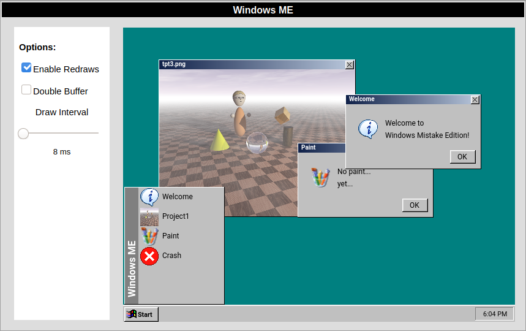
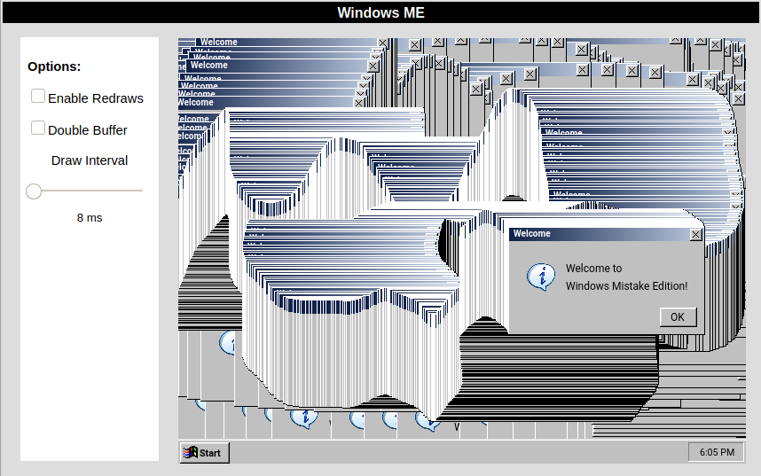
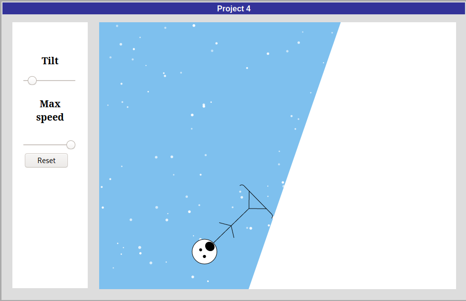

In my [computer graphics](https://cs.calvin.edu/courses/cs/352/index.html) class I was assigned [a project](https://cs.calvin.edu/courses/cs/352/projects/proj2.pdf) to create a "self portrait" using HTML canvas. The assigned required demonstration of basic usage by drawing shapes, text, colors, and a gradient. Classic windows has all these requirements covered. It draw's plenty of text and shapes and the window title bars had a color gradient. I had some extra time as it's early in the semester so I decided to create a imitation of classic Windows. It counts a self portrait since I included an entry in the start menu that opens an my first project, a self portrait rendered with raytracing using povray and constructive solid geometry.

Looking ahead I saw that the next project was to create a paint program. Originally I wanted to have paint program run within a window on this project, and possibly all future projects for the class. Now that I've finished this project I've decided it probably won't be worth the amount of time needed to get that working. Still the end result is quite entertaining. It even has the best classic windows feature (try turning "Enable Redraws" off)!

My project made it into the showcase where the coolest 2nd projects from each semester the class is available. Projects in this showcase were shown to us to inspire our second projects, hopefully mine will inspire a future student to get creative!

<https://cs.calvin.edu/courses/cs/352/showcase/selfportrait.html>

You can play with the end result here:

<https://therontjapkes.com/projects/CS352/proj2/proj2.html>

## Screenshots

## Update:

My project 4 also made it's respective showcase!

<https://cs.calvin.edu/courses/cs/352/showcase/widget.html>

Check it out here:

<https://therontjapkes.com/projects/CS352/proj4/proj4.html>

